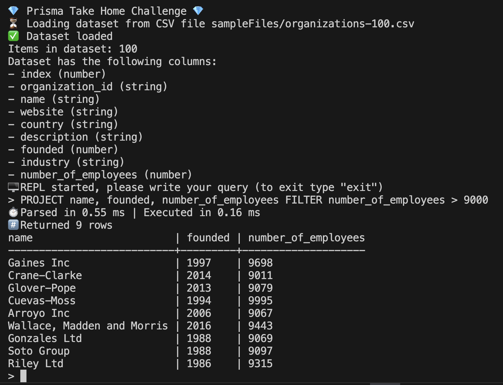

# Prisma Take Home Challenge

The app is a 0-dependencies CLI REPL for querying CSV dataset with a basic query language.  
Node version 20.18.0+

## Running the REPL

1. Clone the repo
2. Install dependencies (it's 0 dependencies project, but still need typescript)

```
npm install
```

3. Run the app (point it to the `.csv` file to load as a dataset)

```
npm run repl sampleFiles/organizations-100.csv
```

4. Query the data, for example:  
   `PROJECT name, founded, number_of_employees FILTER number_of_employees > 9000`



## Query langauge

Query language is similar to SQL, with `PROJECT` clause (similar to `SELECT` in SQL) and `FILTER` clause (similar to `WHERE` in SQL).

e.g. `PROJECT first_name, last_name FILTER age > 18`

- All queries must start with `PROJECT` keyword.
- All column names are in `snake_case`, e.g. CSV's original `First Name` is transformed into `first_name`
- You can use wildcard (`*`) to select all columns
- `FILTER` clause is optional

### Filter clause

Filter clause syntax is `FILTER columnName operator filterValue`

Filter clause supports `>`, `<` and `=` operators.

#### With numeric values

`=` returns rows where `columnName` value is equal to `filterValue`  
`>` returns rows where `columnName` value is greater than `filterValue`  
`>` returns rows where `columnName` value is less than `filterValue`

#### With string values

`=` returns rows where `columnName` value is equal to `filterValue`  
`>` returns rows where `columnName` value is greater than `filterValue` **lexicographically**  
`>` returns rows where `columnName` value is less than `filterValue` **lexicographically**

## Questions & Answers

### What were some of the tradeoffs you made when building this and why were these acceptable tradeoffs?

I've decided to write own CSV parser to have more control over the whole process. However, current implementation is probably a bit naive in multiple places and can be optimized. It also lacks features like custom delimiter character (currently only comma is supported). Overall the csv parser is not production-ready, needs more unit tests, test samples, etc.
It is an acceptable tradeoff since I gain more control over the flow and formatting of data in the app, not needing to confine to some third-party library API.

### Given more time, what improvements or optimizations would you want to add? When would you add them?

I would go through the parts of the code that loop over the dataset and check whether or not there is any room for performance improvement there. I would also set up a proper benchmarking tests to monitor if changes affect the performance positively or negatively.
I would also add quality-of-life improvements to the REPL, for example ability to change the dataset to a different one without restarting the program from scratch.

One more area of improvement is the "UI" ("TUI"), right now if you select many fields (or use a wildcard) it might be impossible to read the results due to huge width of the output that wraps in the terminal.  
I would add an optional flag to select rendering method (e.g. `table`, `json`, `csv`, `csv-file`, etc.).

Another quality-of-life improvement would be hints for a user if validation failed, e.g. simple typos in the column name could detect and suggest the correct name of the column.

### What changes are needed to accommodate changes to support other data types, multiple filters, or ordering of results?

- Other data types - I would need to update csv parser (in `parseCsv.ts`) to format new data types (e.g. `boolean`, `BigInt`, `null`, etc) into appropriate type and not just `string`. I would also need to update the `FILTER` clause logic (in `parseQuery.ts`) to allow filtering on these data types.
- Multiple filters - `FILTER` clause parsing logic (in `parseQuery.ts`) would need to be updated to parse the user intent correctly. Depending on the kind of new filter and the way the might combine together the types `FilterCondition` and `FilterFunction` might also need to be updated. The application of filter in `runQuery.ts` also need update. For simple addition of `AND` and `OR` logic the current way of using closure to get filter function (`getFilterFn` in `parseQuery.ts`) might work, but if the logic of combining multiple filters is more complex it would require a more elegant solution (otherwise `getFilterFn` might become too big and hard to read).
- Ordering - obviously parsing logic in `parseQuery.ts` would need to be update to accomodate new keywords. The application of ordering could be as simple as adding sorting in `runQuery.ts` after the filtering, however, perhaps there is a way to sort the items on the fly in the same reduce statement for better performance (I am not sure though if that would be more performant, need to research & benchmark it).

### What changes are needed to process extremely large datasets

The quick and easy CSV parser (`parseCsv.ts`) would certainly need another look. For example, it currently uses Regex to handle various tasks, which can be slow, so it would be nice to get rid of Regex completely, if possible. Another way to improve CSV parsing would be to stream the file content continuously and parse it at the same time, instead of loading the file completely and only then starting parsing.

In terms of improving the query (`runQuery.ts`) engine itself to accommodate exteremely large datasets - I think currently it is pretty well optimized, however, I would explore the possibility of other ways of looping in JS being faster than `.reduce`. For example, in reduce you effectively copy the entire accumulator value on each iteration, which might be slow on large dataset. So perhaps a more manual approach of looping with a for loop could be faster. I would strive to reduce allocation of new memory as much as possible, i.e. reusing same arrays, eliminating temporary variables, etc.

### What do you still need to do to make this code production ready?

The number one thing is probably just testing it with more samples of CSV documents. During the development I've only ran it across couple of CSV files, which might represent ideal case and don't handle the edge cases very well. I would either explore available third-party CSV parsers or spend more time improving current self-written parser.
The app should also be tested on different machnines, e.g. on Windows the encoding of files might be different, and is currently completely untested. Testing of CSV files with non-English characters would also be nice.

The production version also must specify all the ways you can use this program, i.e. right now it is only REPL, but maybe it would be useful to have option to query data from other JS code.

The parsing and execution of queries might also need additional tests, especially regarding various edge cases.

And of course good producton repo should have CI/CD set up, publishing pipeline, documentation, examples, etc.
